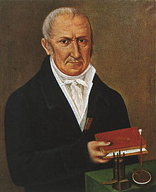

# Reactive JavaScript mit RxJS - BASTA! 2016
## Maximilian Berghoff - 23.03.2016

---

# Who am I?

- Maximilian Berghoff <!-- .element: class="fragment" -->
- @ElectricMaxxx <!-- .element: class="fragment" -->
- github.com/electrimaxxx <!-- .element: class="fragment" -->
- Maximilian.Berghoff@mayflower.de <!-- .element: class="fragment" -->
- Mayflower GmbH - Würzburg <!-- .element: class="fragment" -->

Note: 

---

# Reactive Extensions - Rx

Note: 

---

# History

## Erik Meier <!-- .element: class="fragment" -->
## Brain Backman <!-- .element: class="fragment" -->
## Mathew Podwysocki <!-- .element: class="fragment" -->

---

<!-- .slide: data-background="../docs/images/contributers_rxjs.png" -->

Note:

---

# LINQ to Events

Note:

---

# Volta



Note: 

---

# Windows Forms
# <=> <!-- .element: class="fragment" -->
# Web Forms <!-- .element: class="fragment" -->

Note:

---

# Problem?

Note:

---

## Beispiel:
# Drag & Drop
## Mausbewegung verfolgen

---

## Event Listener Registrieren

```javascript
elem.addEventListener('mousedown', mousedown, false);
elem.addEventListener('mouseup', mouseup, false);
elem.addEventListener('mousemove', mousemove, false);
```

----

## mouse down

```javascript
function mousedown(e) {
    isDown = true;
    state = { startX: e.offsetX, startY: e.offsetY};
}
```

---

## mouse move

```javascript
function mousemove(e) {
    if (!isDown) {return;}
    var delta = {
        endX: e.clientX - state.startX,
        endY: e.clientY - state.startY
    };
}
```
---
## mouse up

```javascript
function mouseup (e) {
    isDown = false;
    state = null;
}
```
---
## unsubscribe

```javascript
function dispose() {
    elem.removeEventListener('mousedown', mousedown, false);
    elem.removeEventListener('mouseup', mouseup, false);
    elem.removeEventListener('mousemove', mousemove, false);
}
```
---

<!-- .slide: data-background="../docs/images/bar.jpg" -->

---
# Die Akteure
---
# Das Iterator Pattern
---
```javascript
var Iterator = function () {};

Iterator.prototype.next();

Iterator.prototype.rewind();

Iterator.prototype.current();

Iterator.prototype.hasNext();
```
---
# Traversieren

```javascript
while (Iterator.hasNext()) {
    console.log(Iterator.next());
}
```
---
# Gedankenspiel

- Liste von Filmen <!-- .element: class="fragment" -->
- Eigenschaften: id, title, url, rating, ... <!-- .element: class="fragment" -->
- Aufgabe: "Trage id & title von allem Filmen mit rating = 5.0 zusammen" <!-- .element: class="fragment" -->
---

```javascript
 var videos = [
     {id: 100001, title: 'Kill Bill 1', 'url': '..', rating: 5.0 },
     { id: 100002, title: 'Kill Bill 2', 'url': '..', rating: 5.0 },
     {id: 100003, title: 'Titanic', 'url': '..', rating: 1.0 }
 ];
```
---
```javascript
var newList = [];
for(var i = 0; i <= videos.length; i++) {
    if (videos[i].rating === 5.0) {
        newList.push({id: videos[i].id, title: videos[i].title})
    }
}

console.log(newList);
```
---
```javascript
var newList = [];

videos.forEach(function (video) {
    newList.push({id: video.id, title: video.title})
});

console.log(newList);
```
---

```javascript
var newList =
    videos
        .reduce(function (video) {
            return video.rating === 5.0;
        })
        .map(function (video) {
           return  {id: video.id, title: video.title};
        });

console.log(newList);
```

---
# Observer Pattern
---

```
Observable.prototype.subscribe()
```

---

```javascript
Observer.prototype.notify()
```

---

```javascript
var Observable = function () {};

Observable.prototype.unsubscribe = function () {};

Observable.prototype.unsubscribe = function () {};

var Observer = function () {};

Observer.prototype.notify = function() {};
```

---

# Warum?

- Entkopplung <!-- .element: class="fragment" -->
- weniger prozedualer Code <!-- .element: class="fragment" -->
- Erweiterbarkeit erhöht <!-- .element: class="fragment" -->

---

<!-- .slide: data-background="../docs/images/hochzeit.jpg" -->

# Die Hochzeit


<span class="attribution">By Ziko van Dijk (shot by myself) [<a href="http://www.gnu.org/copyleft/fdl.html">GFDL</a> or <a href="http://creativecommons.org/licenses/by-sa/3.0">CC BY-SA 3.0</a>], <a href="https://commons.wikimedia.org/wiki/File%3A2007-09-01trauungk%C3%B6ln.jpg">via Wikimedia Commons</a></a></span>
---

# Reactive Extension

- RxJava <!-- .element: class="fragment" -->
- <b>RxJS</b> <!-- .element: class="fragment" -->
- Rx.Net <!-- .element: class="fragment" -->
- Rx.Scala <!-- .element: class="fragment" -->
- Rx.Clojure <!-- .element: class="fragment" -->
- Rx.Swift <!-- .element: class="fragment" -->
- ... <!-- .element: class="fragment" -->

---

# [Reactive.io](http://reactivex.io/)

---

## [github.com/Reactive-Extionsion](https://github.com/Reactive-Extension)

---

# Stream von Events

---

```javascript
var list = [1, 2, 3, 4, 5];

list.forEach(function (item) {
    console.log("nexItem: %s", item);
});
```

---

```javascript
var list = [1, 2, 3, 4, 5];

var source = Rx.Observable.fromArray(list);

var disposal = source.subscribe(
    function (x) {console.log('Next: ' + x);},
    function (err) {console.log('Error: ' + err);},
    function () {console.log('Completed');});

disposal.dispose();
```

---

<!-- .slide: data-background="https://upload.wikimedia.org/wikipedia/commons/d/da/Kindergarten_kids_at_a_public_school_in_Montevideo%2C_Uruguay.jpg" -->

<span class="attribution">By Vince Alongi (Flickr) [<a href="http://creativecommons.org/licenses/by/2.0">CC BY 2.0</a>], <a href="https://commons.wikimedia.org/wiki/File%3AKindergarten_kids_at_a_public_school_in_Montevideo%2C_Uruguay.jpg">via Wikimedia Commons</a></span>

---

# Questions?

- Ask Now!
- Twitter: @ElectricMaxxx <!-- .element: class="fragment" -->
- Mail: Maximilian.Berghoff@mayflower.de <!-- .element: class="fragment" -->

---

# Thank You!
